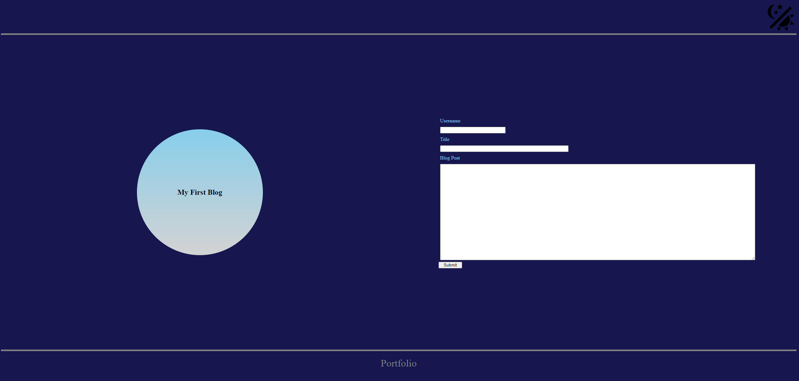
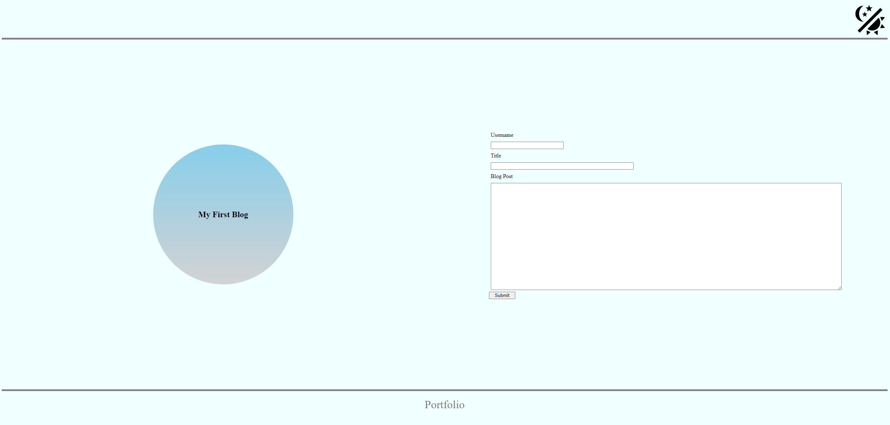
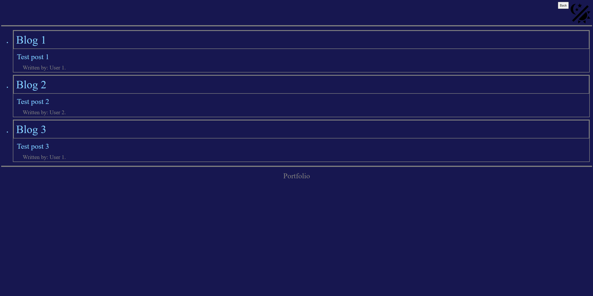
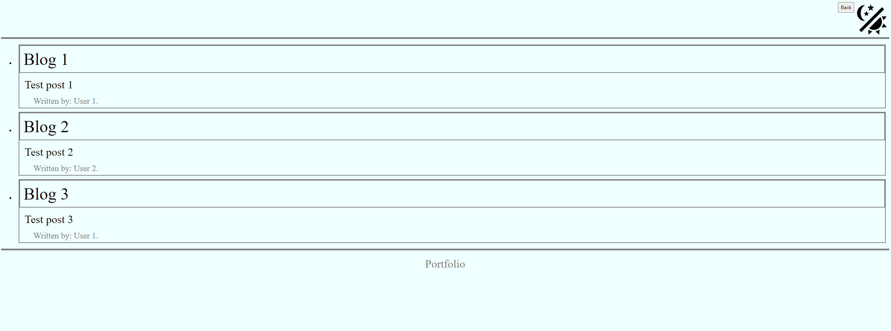

# Blogging Site

## Description

This blog site was created to test the functionality of a light and dark theme for websites. It also tested my knowledge of local storage and how to utilize it. Through this build, I was able to refine my understanding of local storage, attribute settings through JavaScript, and array/DOM navigation.

## Usage

This is a screenshot of the landing page with the form to store a blog post

Light theme version of the form page

This is a screenshot of the page that harbors all the blog posts

Light theme version of the blog list

## Links

Git Repo: https://github.com/ItsToastCrumb/blog-site

Git Page: https://itstoastcrumb.github.io/blog-site/

## Functionality

The form allows you to write a blog post that will be saved and displayed in the list of blogs. All inputs and text areas must have content in order to save the blog.

There is a link to my portfolio in the footer for both pages.

There is a theme toggle image in the upper right corner of the webpage that will allow the user to toggle between light and dark themes as they desire.

The blog list page has a back button that will return the user to the form page to enter another blog post.

## License

Please see LICENSE file in repository.
